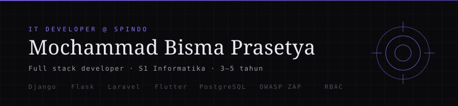

<div align="center">



<br />

<a href="https://readme-typing-svg.herokuapp.com?font=Chakra+Petch&weight=600&size=23&pause=1300&color=F472B6&center=true&vCenter=true&width=620&lines=Full+Stack+Developer+%E2%9A%A1+IT+Developer+%40+Spindo%0ADjango+%C2%B7+Flask+%C2%B7+Laravel+%C2%B7+Flutter+%C2%B7+PostgreSQL%0AS1+Informatika+%E2%80%94+3+sampai+5+tahun+ngoding">
  
</a>

<br />


<br />


<br />


<br /><br />

<a href="https://masbismaa.github.io/Masbismaa/#games"></a>
&nbsp;&nbsp;
<a href="https://masbismaa.github.io/Masbismaa/#games"></a>
&nbsp;&nbsp;
<a href="#-puzzle-bebaskan-diri-dari-domain"></a>

<br /><br />

<a href="#%E5%93%91-sop"><kbd>&nbsp;SOP&nbsp;</kbd></a>&nbsp;
<a href="#-puzzle-bebaskan-diri-dari-domain"><kbd>&nbsp;PUZZLE&nbsp;</kbd></a>&nbsp;
<a href="#-ujian-penyihir"><kbd>&nbsp;QUIZ&nbsp;</kbd></a>&nbsp;
<a href="#-stack"><kbd>&nbsp;STACK&nbsp;</kbd></a>&nbsp;
<a href="#-featured-project"><kbd>&nbsp;PROJECT&nbsp;</kbd></a>&nbsp;
<a href="#-gradient"><kbd>&nbsp;STATS&nbsp;</kbd></a>&nbsp;
<a href="#-kirim-sinyal"><kbd>&nbsp;CONTACT&nbsp;</kbd></a>

</div>

---

```
╔══════════════════════════════════════════════════════════╗
║  呪  M O C H A M M A D   B I S M A   P R A S E T Y A    ║
║     ⚡  F U L L   S T A C K   D E V E L O P E R  ⚡       ║
╚══════════════════════════════════════════════════════════╝
```

## 呪 SOP

```python
class MochammadBismaPrasetya:
    name   = "Mochammad Bisma Prasetya"
    handle = "Masbismaa"
    grade  = "IT Developer @ Spindo"
    degree = "S1 Informatika"
    years  = 3 - 5

    backend  = ["Django", "Flask", "Laravel", "CodeIgniter"]
    mobile   = ["Flutter", "Dart", "Firebase"]
    database = ["PostgreSQL", "MySQL", "MongoDB"]
    vows     = ["OWASP ZAP", "RBAC", "Audit Log", "OTP", "Rate Limiting"]
    hobbies  = ["anime", "game", "musik"]
    curses   = ["Docker & Cloud", "PenTest", "Microservices", "AI / LLM"]

    def build(self, need):
        return "App yang jalan, aman, dan enak dipakai."
```

Aku **Bisma**, IT Developer di **Spindo** dengan pengalaman ngoding 3 sampai 5 tahun. Lulusan S1 Informatika yang suka membangun aplikasi dari ujung ke ujung: backend **Django**, **Flask**, **Laravel**, frontend web, sampai aplikasi mobile **Flutter**. Aplikasi yang kubangun kugambar dengan **OWASP ZAP** dan kuk.attach **RBAC**, **audit log**, serta login **OTP**.

> Cara kerjaku satu kalimat: **kejar requirement sampai deploy, sambil ngejepit celah XSS & SQLi.**

<details>
<summary><b>🥷 Kenapa repo ini dibuat? <i>(Jawab sendiri ya)</i></b></summary>
<br />

Repo ini bukan cuma portofolio. Ini **arena latihan** — tempat aku ngetes seberapa sering aku buru-buru nulis kode tanpa merusak repo orang.

Yang bisa kamu main di sini:

|                                   |                                    |
| :-------------------------------: | :---------------------------------: |
| 🌀 **Puzzle Domain Expansion**      | Buka, pilih pintu, cari jalan keluar |
| 📜 **Ujian Penyihir** (10 soal)     | Cek kuncinya, ada pembahasannya     |
| 🎰 **Domain Gacha + Binding Vow**   | Ada di website, pakai energi kutukan |
| ✅ **Checklist**                    | Dicentang, statusnya ikut tersimpan |
| 🚪 **Rahasia**                      | Ada yang Closed, jangan dibuka seenak |

</details>

## 🌀 Puzzle: Bebaskan Diri dari Domain

> ⚠️ Geser scroll pelan-pelan, lalu klik **pintu** satu per satu.
> Kunci jawabannya disembunyikan di dalam pintu yang kamu pilih.

<details open>
<summary><b>🚪 Pintu 1 — "Ruang yang Terlalu Terang"</b></summary>
<br />

Kau melangkah masuk. Semua lampu neon menyala, dindingnya **putih**, dan di depanmu ada **4 saklar**. Cuma satu saklar yang menyalakan pintu keluar.

Energi kutukanmu tinggal **20**. Kalau salah, domain ini makin rapat.

> 🔢 **Petunjuk:** *Saklarnya menyala dari kanan ke kiri: nomor 4, lalu 3, lalu 2, lalu 1.*

<details>
<summary><b>💡 Nyalakan saklarnya</b></summary>
<br />

Kau tekan saklar **nomor 1**.

> ❌ **SALAH.**
> Yang menyala pertama adalah nomor **4**, bukan 1.
> Energi kutukanmu turun, domain menyempit.

</details>

<details>
<summary><b>🔁 Coba lagi — pakai urutan yang benar</b></summary>
<br />

Saklarnya harus ditekan **urutan 4 → 3 → 2 → 1**.

> ✅ **BETUL!**
> Tapi sayangnya kau baru menyalakan saklar terakhir, dan pintunya ada di belakangmu.
> Pintu 1 **buntu**.

</details>

</details>

<details>
<summary><b>🚪 Pintu 2 — "Koridor Berjam"</b></summary>
<br />

Koridor ini berputar-putar. Di ujungnya ada **tiga arca kutukan**: mata, api, dan darah. Semuanya tampak utuh, tidak ada yang rusak.

<details>
<summary><b>🔍 Periksa artefaknya</b></summary>
<br />

Tertulis di tembok:

```text
mata  = 30
api   = 45
darah = 25
```

<details>
<summary><b>🧮 Hitung dulu totalnya</b></summary>
<br />

30 + 45 + 25 = **100**.

> ✅ **Tepat 100 — semua artefak utuh.**
> Tidak ada yang hilang, jadi ini bukan soal penjumlahan.

</details>

<details>
<summary><b>👁️ Sentuh arca "mata" (kira-kira penyebab) <i>jangan langsung klik</i></b></summary>
<br />

> ❌ **SALAH.** Tidak ada artefak yang rusak, jadi tidak ada yang perlu dipulihkan.

</details>

</details>

<details>
<summary><b>🚪 Buka pintu dengan menyentuh ketiganya sekaligus</b></summary>
<br />

Kau sentuh mata, api, dan darah sekaligus.

> ❌ **SALAH — ini tipuannya.**
> Kalau semuanya memang utuh, berarti **tidak ada** yang perlu diaktifkan.
> Energi kutukanmu tinggal **5**. Pintu 2 **buntu**.

</details>

</details>

<details>
<summary><b>🚪 Pintu 3 — "Ruang Tenang" <i>(ini yang benar)</i></b></summary>
<br />

Tidak ada jebakan di sini. Hanya **sebuah tombol merah** dan tulisan di dinding:

> *"Kalau kamu mau keluar, tekan tombolnya. Kalau salah, kamu menghabiskan sisa hidupmu di sini."*

Tombol itu dikelilingi **9 lingkaran konsentris**.

<details>
<summary><b>🔴 Tekan tombolnya</b></summary>
<br />

> ✅ **KELUAR!**
> Bukan lingkaran luarnya, tapi **pusatnya** yang kau tekan.
>
> Alasannya: *penyihir selalu mengarahkannya ke titik yang paling dekat dengan inti.*

</details>

<details>
<summary><b>✅ Lihat seluruh jawabannya sekaligus</b></summary>
<br />

| Pintu | Jawaban | Kenapa |
|:-----:|:-------:|:-------|
| 1 | Urutan **4 → 3 → 2 → 1** | Sapu dari kanan ke kiri, tapi pintu 1 sendiri buntu |
| 2 | **Tidak ada** yang perlu disentuh | 30 + 45 + 25 = 100, semuanya utuh |
| 3 | **Pusat** lingkaran | Titik paling dalam = pusat |

> 🧠 **Polanya sama di semua pintu:** penyihir bekerja **dari dalam ke luar**, dari yang paling dekat ke inti dulu.

</details>

<details>
<summary><b>💭 Kenapa ada puzzle ini di portofolio?</b></summary>
<br />

Karena satu hal yang sering aku temui di kode:

> **Over-engineering itu mahal. Yang sering menang justru solusi paling dekat.**

Pintu 1 dan 2 itu jebakan — alat yang lebih rumit dari yang perlu. Pintu 3 cuma butuh **satu klik di tengah**, dan itu yang bikin berhasil.

Di kode produksi juga begitu: jangan pakai yang paling keren kelihatan, pakai yang paling dekat dengan solving masalah.

</details>

</details>

## 📜 Ujian Penyihir

Jawab dulu di kepalamu, baru klik buat lihat kunci dan pembahasannya.

> Versi interaktifnya (timer 20 detik per soal, skor, dan streak) ada di website: **🎰 Domain Expansion**.

<details>
<summary><b>1. Gojo Satoru dipanggil apa di dunia penyihir?</b></summary>
<br />

> **Jujutsu Kaisar** — julukan penyihir terkuat, diwariskan sejak era Sukuna.

</details>

<details>
<summary><b>2. Black Flash itu apa?</b></summary>
<br />

> **Meletakkan energi kutukan 2,5 kali lipat dalam satu hantaman.**
> Itu teknik Yuji Itadori. Hasilnya nyaris mustahil, dan cuma segelintir orang yang bisa melakukannya.

</details>

<details>
<summary><b>3. "Malevolent Shrine" adalah Domain Expansion milik siapa?</b></summary>
<br />

> **Ryomen Sukuna** — domain tanpa barrier yang langsung memberi efek ke seluruh arena.

</details>

<details>
<summary><b>4. Teknik bawaan Nobara Kugisaki apa?</b></summary>
<br />

> **Straw Doll Technique** — menusuk boneka jerami dengan paku dan palu, sehingga korban ikut merasakan sakitnya dari jarak jauh.

</details>

<details>
<summary><b>5. Film "Jujutsu Kaisen 0" menceritakan siapa?</b></summary>
<br />

> **Gojo muda dan Riko Amanai** — sekaligus penjelasan hubungan Yuji dengan Riko.

</details>

<details>
<summary><b>6. Kenapa Toji Fushiguro dijuluki "Sorcerer Killer"?</b></summary>
<br />

> Karena **sama sekali tidak punya energi kutukan**, tapi kecepatan dan kelihaian fisiknya membuat ia bisa membunuh penyihir.

</details>

<details>
<summary><b>7. "Unlimited Void" itu Domain Expansion siapa?</b></summary>
<br />

> **Gojo Satoru** — membanjiri target dengan informasi tak hingga sampai gerak target lumpuh total.

</details>

<details>
<summary><b>8. Teknik bawaan Toge Inumaki apa?</b></summary>
<br />

> **Cursed Speech** — target yang mendengar kata-katanya bisa dipaksa menyeimbangkan diri, atau dibunuh.

</details>

<details>
<summary><b>9. Kekuatan Makima di Chainsaw Man apa?</b></summary>
<br />

> **Kontrol** — memengaruhi pikiran orang supaya ia melihat dia sebagai kebenaran absolut.

</details>

<details>
<summary><b>10. Inumaki atau Nobara, mana yang bisa "sekali jadi"?</b></summary>
<br />

> **Inumaki** — Cursed Speech cukup satu kalimat untuk menyeimbangkan atau membunuh.
> **Nobara** — butuh paku dan palu, tapi bisa menembus barrier dari jarak jauh.

</details>

<details>
<summary><b>🏆 Bonus: Kenapa dua-duanya penting?</b></summary>
<br />

> Satu hasil instan tanpa persiapan (**Inumaki**), satu yang sudah disiapkan posisi (**Nobara**).
> Di dunia nyata juga sama: kadang yang paling cepat menang, kadang yang paling siap.

</details>

## ✅ Checklist — Centang yang Sudah Kamu Coba

Centang yang **sudah kamu coba**. Checkbox GitHub bisa diklik langsung dan statusnya **ikut tersimpan** di akun kamu.

- [ ] 🎰 Main **Domain Gacha** di website
- [ ] 📜 Selesaikan **Ujian Penyihir**, lalu ulangi buat ngalahin skor sendiri
- [ ] ⛓ Coba **Binding Vow** (jackpot 50%, jeito tapi bikin nagih)
- [ ] 🌀 Selesaikan **Puzzle Domain Expansion** di atas tanpa buntu
- [ ] 👁️ Ketik **"domain"** di website untuk nemu easter egg
- [ ] ⌨️ Coba **Konami**: `↑ ↑ ↓ ← → ← → B A`
- [ ] 📂 Buka repo **mtoa_alr** — project andalanku
- [ ] ⭐ Kasih **star** kalau kamu suka temanya

## 🗳️ Pilih Karaktermu

<details>
<summary><b>🗳️ Kalau kamu jadi penyihir, jurus pertamamu apa?</b></summary>
<br />

| Pilihan | Alasan |
|:-------:|:-------|
| ⚡ **Blue** | Tendangan cepat, tipe serang cepat |
| 🕸️ **Purple** | Damage besar sekali, tapi harus akurasi |
| 🛡️ **Red** | Defense paling kuat, cocok kalau kamu mau ribut |
| 🩸 **Straw Doll** | Jarak jauh, cuma perlu satu paku |
| 📚 **Copy** | Minimal risiko, tapi juga minimal Balik |

> Lilih dan vote di [Issues](https://github.com/Masbismaa/Masbismaa/issues/new) — hasil terbaiknya nanti kutulis di sini.

</details>

<details>
<summary><b>⚡ Guess what: jurus Yuji itu teknik bawaan atau bahasa tubuh?</b></summary>
<br />

> **Keduanya.** Yang "^Divergent Fist^" adalah bahasa tubuh, dan **Black Flash** muncul dari hantaman pertama yang dianggap mustahil itu.

</details>

## 🧿 Stack

<div align="center">


</div>

<details open>
<summary><b>⚙️ Backend</b> &nbsp;<sub>Django · Flask · Laravel · CodeIgniter</sub></summary>
<br />

| Alat | Kenapa dipakai |
|:----:|:---------------|
| **Django** | Framework lengkap: ORM, admin, auth, dan proteksi keamanan bawaan. |
| **Flask** | Ringan dan minimalis, cocok buat API yang disusun modular. |
| **Laravel** | PHP modern: Eloquent, migration, routing, dan autentikasi siap pakai. |
| **CodeIgniter** | Ringan, konfigurasi minim, buat aplikasi skala kecil sampai menengah. |

</details>

<details>
<summary><b>📱 Frontend & Mobile</b> &nbsp;<sub>HTML/CSS/JS · Tailwind · Flutter</sub></summary>
<br />

| Alat | Kenapa dipakai |
|:----:|:---------------|
| **HTML / CSS / JS** | Tiga bahasa pondasi web: struktur, tampilan, dan interaksi. |
| **Tailwind CSS** | Styling ditulis langsung di markup tanpa file CSS panjang. |
| **Flutter** | Satu basis kode untuk Android, iOS, dan web. |

</details>

<details>
<summary><b>🗄️ Database</b> &nbsp;<sub>PostgreSQL · MySQL · MongoDB</sub></summary>
<br />

| Alat | Kenapa dipakai |
|:----:|:---------------|
| **PostgreSQL** | Relasional kuat: transaksi, relasi antar tabel, dan data JSON. |
| **MySQL** | Cepat dan ringan, sangat umum dipakai di hosting. |
| **MongoDB** | NoSQL berbasis dokumen, cocok untuk data JSON yang fleksibel. |

</details>

<details>
<summary><b>🛡️ Testing & Keamanan</b> &nbsp;<sub>Pytest · OWASP ZAP · RBAC · OTP</sub></summary>
<br />

| Alat | Kenapa dipakai |
|:----:|:---------------|
| **Pytest** | Test ditulis sebagai fungsi biasa dengan `assert`, singkat dan enak dibaca. |
| **OWASP ZAP** | Scan celah web otomatis: XSS, SQL injection, dan lainnya. |
| **RBAC** | Otorisasi berbasis role, supaya data Public dan Private bisa dipisah. |
| **OTP** | Verifikasi dua langkah untuk login, password saja tidak cukup. |
| **Audit Log** | Jejak siapa, kapan, mengubah apa. Immutable supaya bisa diaudit. |

</details>

<details>
<summary><b>🛠️ Tools</b> &nbsp;<sub>Git · GitLab CI · PowerShell · VS Code</sub></summary>
<br />

| Alat | Kenapa dipakai |
|:----:|:---------------|
| **Git** | Semua perubahan tercatat per branch, bisa kembali ke versi lama. |
| **GitLab CI** | Build dan test otomatis setiap kali kode di-push. |
| **PowerShell** | Shell sekaligus bahasa scripting Windows untuk otomasi. |
| **VS Code** | Editor gratis dengan ribuan extension. |

</details>

## 💥 Featured Project

<div align="center">

**ALR — Access Link Register** · [`mtoa_alr`](https://github.com/Masbismaa/mtoa_alr)

</div>

**ALR** menyatukan link akses ICT yang sebelumnya tersebar ke dalam satu web app, lengkap dengan petunjuk dan kredensialnya.

<details>
<summary><b>✨ Fitur utamanya</b></summary>
<br />

| Fitur | Keterangan |
|:-----:|:-----------|
| Login dua langkah | Email korporat dan password, lalu verifikasi **OTP** |
| Role dan permission | **Admin** dan **User Entry**, data **Public** atau **Private** |
| Form dinamis | Field menyesuaikan kategori: Web, Application, Network, General |
| Validasi | Format URL, deteksi duplikat, tipe dan ukuran file |
| Search dan export | Cari berdasarkan keyword, lalu export ke **Excel** |
| Workspace | Group dengan fitur **invite** anggota |
| Audit log | Immutable: siapa, kapan, apa, nilai lama versus baru |
| UI | Neobrutalism, sidebar, UI customizer, dark mode |

</details>

<details>
<summary><b>🗂️ Struktur backend-nya</b></summary>
<br />

```text
app/
├── routes/      endpoint & request handling
├── services/    logika bisnis
├── models/      ORM (PascalCase singular)
├── schemas/     validasi input/output
├── security/    auth, OTP, RBAC
└── utils/       helper yang dipakai ulang
tests/
└── test_*.py    skenario positive & negative
```

</details>

<details>
<summary><b>🎮 Mau main yang interaktif? Buka website-nya</b></summary>
<br />

Di bagian **Domain Expansion** di website ini ada:

- 🎰 **Domain Gacha** — mesin slot kutukan, energi kutukan pulih otomatis
- 📜 **Ujian Penyihir** — 12 soal, 20 detik per soal, ada streak dan pembahasan
- ⛓ **Binding Vow** — untung-rugi: menang energi dobel, kalah habis semua

> [<b>▶ MASUK KE DOMAIN EXPANSION</b>](https://masbismaa.github.io/Masbismaa/#games)

</details>

<details>
<summary><b>📦 Proyek lainnya</b> &nbsp;<sub>klik buat lihat</sub></summary>
<br />

| Kategori | Proyek | Keterangan | Stack |
|:--------:|:------:|:-----------|:------|
| Kantor | **Inventaris Aset IT** | Mencatat dan melacak aset IT kantor, dari perangkat sampai lisensi | Django |
| Kantor | **Dashboard Laporan** | Merangkum data jadi rekap dan grafik untuk manajemen | Django |
| Website | **Toko Online** | Menampilkan katalog produk dan mengelola pesanan | Laravel, MySQL |
| Website | **Sistem Informasi** | Mengelola data instansi seperti sekolah atau klinik | Laravel, MySQL |
| Mobile | **Aplikasi Kasir (POS)** | Mencatat transaksi penjualan langsung dari HP | Flutter |
| Mobile | **Katalog dan Pemesanan** | Katalog produk dengan alur pememesanan | Flutter |
| Mobile | **Pelaporan Lapangan** | Mengirim laporan kegiatan dari lapangan | Flutter |
| Kuliah | **Skripsi: Inventaris Toko** | Mencatat stok barang kelontong, tersinkron real-time | Flutter, Firestore |

> Daftar lengkap ada di [<b>GitHub</b>](https://github.com/Masbismaa?tab=repositories).

</details>

<details>
<summary><b>🔁 Contoh cara saya commit</b></summary>
<br />

```bash
git commit -m "feat: tambah validasi duplikasi url"
git commit -m "fix: perbaiki pengecekan role user entry"
git commit -m "docs: update panduan instalasi"
git commit -m "test: tambah skenario negative login otp"
```

</details>

## 😀 Gradient

<div align="center">


<br /><br />


</div>

## 🙋 Tanya Jawab Cepat

<details>
<summary><b>❓ Tech stack-nya apa aja?</b></summary>
<br />

> **Backend:** Django, Flask, Laravel, CodeIgniter, Python
> **Mobile:** Flutter, Dart, Firebase
> **Database:** PostgreSQL, MySQL, MongoDB
> **Keamanan:** OWASP ZAP, RBAC, audit log, OTP, rate limiting
> **Tools:** Git, GitLab CI, PowerShell, VS Code, Postman

</details>

<details>
<summary><b>❓ Kenapa username-nya "Masbismaa"?</b></summary>
<br />

> "Mas" untuk yang **mau lagi**, "Bism" dari nama Bimsa, dan "aa" biar gampang dipanggil.

</details>

<details>
<summary><b>❓ Website-nya pakai framework apa?</b></summary>
<br />

> **Nggak.** HTML, CSS, dan JavaScript murni, tanpa framework, supaya ringan dan tema cursed energy-nya tetap jalan mulus.
> Daftar tools lengkap ada di bagian [🧿 Stack](#-stack).

</details>

<details>
<summary><b>❓ Kenapa pakai OFFSET 0? <i>Belum ada yang nanya, tapi aku suka</i></b></summary>
<br />

> Karena tiap commit kecil itu harus **bergerak ke depan**. Gw izinkan commit besar asalkan pesannya jelas.

</details>

<details>
<summary><b>🔑 Rahasia: commit message pertama aku</b></summary>
<br />

```text
init: setup repo pertama
```

> Ya. itu saja.
> Dari situ berubah jadi `feat:`, `fix:`, `docs:`, `test:` — disiplin sejak awal.

</details>

<details>
<summary><b>❓ Mau main yang beneran interaktif?</b></summary>
<br />

> Semua game ada di website, lengkap dengan partikel cursed energy yang ngikutin kursor.
> [<b>▶ masbismaa.github.io/Masbismaa</b>](https://masbismaa.github.io/Masbismaa/#games)

</details>

## 📬 Kirim Sinyal

<div align="center">

<a href="mailto:moch.bismap@gmail.com"></a>
<a href="https://www.instagram.com/bisma.prasetya_"></a>
<a href="https://github.com/Masbismaa"></a>
<a href="https://masbismaa.github.io/Masbismaa/"></a>

<br /><br />

<a href="https://masbismaa.github.io/Masbismaa/#games"></a>

</div>

---

<div align="center">

```
⚡  SPECIAL GRADE  ⚡
KODING ITU KECIL. YANG BESAR ADALAH ENERGI YANG SELALU KEMBALI.
```

<sub>呪術師 · <b>MOCHAMMAD BISMA PRASETYA</b> · built with cursed energy</sub>

<br />

[↑ Kembali ke atas](#%E5%93%91-sop)

</div>
